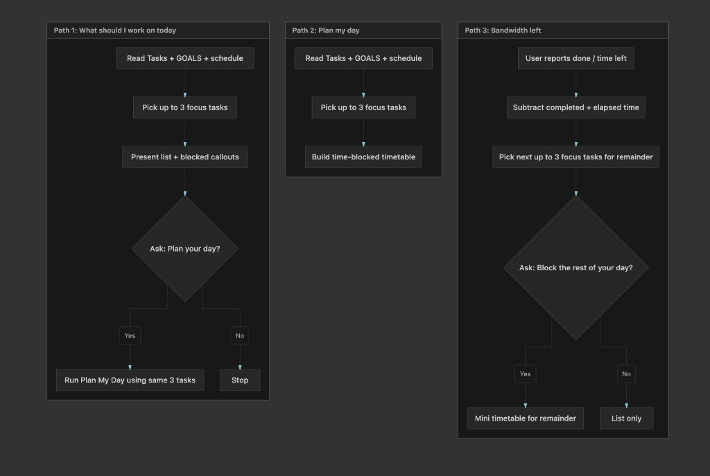

# PersonalOS

[](https://creativecommons.org/licenses/by-nc-sa/4.0/)

> Your AI-powered personal task management system — built for focus, not complexity.

Brain dump into `BACKLOG.md`, tell your AI assistant to process it, and get organized tasks automatically prioritized against your goals.

---

## What's in this fork?

This is a fork of [amanaiproduct/personal-os](https://github.com/amanaiproduct/personal-os) with the following additions:

| Added feature | What it does |
|---|---|
| **Help menu** | Type `menu` or `help` — see all commands. Nothing runs until you pick. |
| **3 planning paths** | Choose how you want to plan: quick focus list, full time-blocked day, or "I finished early, what's next?" |
| **Time-blocked timetable** | AI builds a schedule with real time slots, buffers, and P0 tasks in peak hours |
| **`schedule.md` support** | Tell the system your available hours, overrides, and day-of changes |
| **Replan flow** | "I lost 2 hours" → AI rebuilds your day around what's left |
| **Weekly check-in** | Counts P0/P1 completions vs. goals, surfaces what slipped |

---

## Quick Start

### 1. Clone the repo

```bash
git clone https://github.com/i-am-upasanapattanaik/personal-os.git
cd personal-os
```

### 2. Run setup (~2 min)

```bash
./setup.sh
```

The setup will:
- Create your workspace directories
- Ask about your goals and priorities
- Generate your personalized `GOALS.md`
- Copy all template files

> Python 3.10+ only needed if you want the optional MCP server. Basic setup is bash only.

### 3. Set up your schedule (optional but recommended)

```bash
cp schedule.example.md schedule.md
# Edit schedule.md with your real available hours
```

### 4. Start using it

```
# In Claude Code or your AI assistant:
"Read AGENTS.md and help me get organized"
```

---

## How the daily planning works

Type `menu` or `help` to see all options. The three main planning paths are:

**Path 1 — Quick focus** (`"What should I work on today?"`)
Reads your tasks + goals → picks up to 3 focus tasks → shows blocked callouts → asks if you want a full timetable

**Path 2 — Full day plan** (`"Plan my day"`)
Reads your tasks + goals + schedule → picks up to 3 focus tasks → builds a time-blocked timetable

**Path 3 — Bandwidth left** (`"I have X hours left, what's next?"`)
Subtracts completed + elapsed time → picks next batch of tasks → asks if you want a mini timetable for the remainder

### Planning paths flow diagram



---

## All commands

| What to type | What happens |
|---|---|
| `"menu"` or `"help"` | Show all options — nothing runs until you pick |
| `"What should I work on today?"` | Path 1: quick focus list |
| `"Plan my day"` | Path 2: full time-blocked schedule |
| `"I have X hours left"` | Path 3: replan for remaining time |
| `"Replan my day — I lost X hours"` | Emergency replan with warning header |
| `"Process my backlog"` | Turn BACKLOG.md notes into organized tasks |
| `"Show me my P0 tasks"` | See urgent items only |
| `"Mark [task] as done"` | Complete work |
| `"Weekly check-in"` | P0/P1 completion summary vs goals |

---

## Priority system

| Priority | Meaning | Limit |
|---|---|---|
| **P0** | Do today | max 3 |
| **P1** | This week | max 7 |
| **P2** | Scheduled | — |
| **P3** | Someday/maybe | — |

---

## Directory structure

```
personal-os/
├── core/                    # Reusable system components (public)
│   ├── evals/              # Session evaluations
│   ├── mcp/                # MCP server implementation
│   │   └── server.py       # Core server with deduplication
│   ├── templates/          # Template files for users
│   │   ├── AGENTS.md       # AI instruction template
│   │   ├── config.yaml     # Configuration template
│   │   └── gitignore       # Gitignore template
│   └── README.md           # Core system documentation
│
├── Tasks/                  # Your personal tasks (gitignored)
├── Knowledge/              # Reference docs & notes (gitignored)
├── BACKLOG.md              # Your backlog inbox (gitignored)
├── GOALS.md                # Your goals (generated by setup)
├── AGENTS.md               # Your AI agent instructions
├── schedule.md             # Your availability (gitignored, create from example)
├── schedule.example.md     # Template — copy this to schedule.md
└── setup.sh                # Interactive setup script
```

---

## Daily rhythm

| Time | Action |
|---|---|
| **Morning** | `"Plan my day"` → get a time-blocked schedule |
| **During work** | Brain dump into `BACKLOG.md`, save docs to `Knowledge/` |
| **Finished early** | `"I have X hours left"` → get next batch |
| **Lost time** | `"Replan my day — I lost X hours"` → rebuilt plan |
| **End of day** | `"Mark [task] as done"` |
| **Weekly** | `"Process my backlog"` + `"Weekly check-in"` |

---

## License

CC BY-NC-SA 4.0 — original framework by [Aman Khan](https://github.com/amanaiproduct/personal-os). Fork additions by Upasana Pattanaik.
You may view, use, modify, and share with attribution for non-commercial purposes.
Full license: https://creativecommons.org/licenses/by-nc-sa/4.0/legalcode
